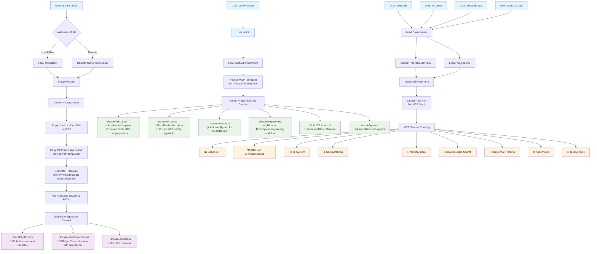

# AI Developer Project Architecture



## How It Works

### 1. One-Time AI Development Setup
```bash
# Install the AI development environment
./install.sh

# Configure your personal AI credentials
ai setup
```

**Creates global configuration in `~/.local/ai-dev/`:**
- 🔧 **Global environment** (`~/.local/ai-dev/.env`) - Your AI development credentials  
- 🔌 **MCP profiles** (`~/.local/ai-dev/mcp-profiles/`) - DRY profile architecture with base layers
- 📚 **MCP base layers** (`~/.local/ai-dev/mcp-layers/`) - Reusable base layer components
- ⚡ **CLI command** (`~/.local/ai-dev/bin/ai`) - Main launcher with CLI/app separation

**The `ai setup` command:**
- Shows you exactly where to find your credentials file
- Lists which variables need your actual values
- Optionally opens the file in your editor
- Provides clear instructions on what credentials to add

### 2. Per-Project Setup
```bash
cd my-project
ai init  # Creates project-specific configs
```

**Creates project-specific configurations:**
- 📱 **Claude Code config** (`.claude/.mcp.json` → `~/.local/ai-dev/mcp.json`) - Symlinked MCP config
- 🎯 **Cursor config** (`.cursor/mcp.json` → `~/.local/ai-dev/mcp.json`) - Symlinked MCP config  
- 📋 **Engineering workflow** (`.claude/engineering-workflow.md`) - Complete JIRA integration workflow
- 📝 **Local workflow reference** (`CLAUDE.local.md`) - Not committed to version control
- 🤖 **Claude Sub Agents** (`.claude/agents/`) - 4 specialized workflow assistants
- 📋 **Cursor rules** (`.cursor/rules.json`) - Auto-configured for project instructions

### 3. Launch AI Tools
```bash
ai claude      # Launch Claude Code (desktop app)
ai claude-app  # Launch Claude Desktop app
ai cursor      # Launch Cursor CLI (cursor-agent)
ai cursor-app  # Launch Cursor app (full editor)
```

**Environment loading order:**
1. 🌐 **Global AI credentials** from `~/.local/ai-dev/.env` (GitLab, Datadog, Atlassian, etc.)
2. 🏠 **Project-specific overrides** from project `.env` (database URLs, API secrets, etc.)
3. 🚀 **Launch tool** with full MCP server stack

**Note:** Most projects won't need a `.env` file - your AI tools use the global credentials. Only create project `.env` files for project-specific overrides.

### 4. MCP Servers Available (Profile-Based)
- 📊 **GitLab** - Issues, MRs, repositories (read-only for qa, read-write for devops)
- 🏗️ **Atlassian** - JIRA tickets, Confluence pages (all profiles)
- 📁 **File System** - File operations and project structure (all profiles)
- 🔍 **Git** - Repository operations and history (all profiles)
- 💾 **Memory Bank** - Persistent knowledge storage (persistent, research profiles)
- 🔍 **DuckDuckGo** - Real-time web search (research profile)
- 🧠 **Sequential Thinking** - Step-by-step reasoning (research profile)
- ⚙️ **Kubernetes** - Cluster operations (devops profile)
- 🧪 **Testing Tools** - Cypress, test analyzers (qa profile)

## Key Benefits

✅ **One installation, all projects** - Global MCP profiles work everywhere  
✅ **Centralized credentials** - Set once, use everywhere with smart sync (`ai env-sync`)
✅ **5 specialized profiles** - Default, persistent, devops, qa, research profiles available
✅ **Symlinked configurations** - Projects reference global configs (no duplication)
✅ **Cross-tool compatibility** - Same MCP servers work in Claude Code, Cursor, etc.  
✅ **Engineering workflows** - Built-in JIRA integration and 4 specialized sub agents
✅ **Smart environment management** - Global `.env` with local project overrides

## Understanding Environment Variables

### AI Development Credentials (Global)
**Location:** `~/.local/ai-dev/.env`  
**Contains:** Personal API keys and tokens for AI development
```bash
GITLAB_PERSONAL_ACCESS_TOKEN=your-gitlab-token
GITLAB_API_URL=https://gitlab.example.com
GIT_AUTHOR_NAME="Your Name"
GIT_AUTHOR_EMAIL="your-email@company.com"
```

### Project-Specific Variables (Optional)
**Location:** `your-project/.env`  
**Contains:** Project's runtime configuration
```bash
DATABASE_URL=postgres://localhost/myapp
REDIS_URL=redis://localhost:6379
API_SECRET=project-specific-secret
```

**Key Point:** These are separate concerns. AI tools need your personal API credentials, while your application needs project-specific configuration.

## Profile System

### Available Profiles
- **`default`** - Basic MCP server setup
- **`devops`** - DevOps-focused with GitLab and Kubernetes
- **`qa`** - QA-focused with testing and validation tools
- **`research`** - Research-focused with memory and search capabilities
- **`persistent`** - Memory-enabled for long-term project knowledge

### Profile Selection
```bash
ai claude --profile devops      # Claude Code with devops profile
ai claude-app --profile qa     # Claude Desktop with qa profile
ai cursor --profile research   # Cursor CLI with research profile
ai cursor-app --profile devops # Cursor app with devops profile
```

### Profile Architecture (DRY Base Layers)
**Base Layers:**
- **common**: Core tools (filesystem, git) - included in all profiles
- **conversational**: Serena conversational AI - included in most profiles  
- **persistent**: Memory-bank for cross-session persistence

**Profile Composition:**
- **default**: layers=[common] + atlassian
- **persistent**: layers=[common, conversational, persistent]
- **devops**: layers=[common, conversational] + gitlab(RW) + k8s
- **qa**: layers=[common, conversational] + gitlab(RO) + cypress + test-analyzer
- **research**: layers=[common, conversational, persistent] + search tools