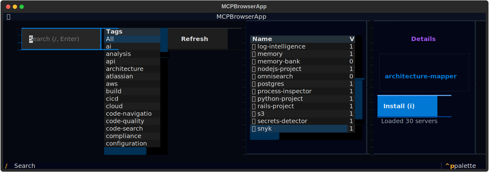

# MCP Browser TUI

This Textual-based TUI lets you browse, filter, and install MCP servers without leaving the terminal. It is bundled with an offline registry fallback so it works even when `raw.githubusercontent.com` is blocked.

## Launch

- From the CLI (recommended): `ai mcp browse`  
  - `--refresh` forces a fresh registry fetch (press `r` inside the app to refresh at any time).
- Direct module: `python -m aidev.tui_mcp_browser`

## Controls

- `/` — focus search
- `r` — refresh registry
- `i` — install selected server
- Arrow keys / j k — move selection
- `q` — quit

## Panels

- **Filters**: live search + tag filter to narrow results.
- **Registry table**: glyph + name, version, status badge (`stable`/`experimental`/`deprecated`/`concept`), tags, and install status chip (`✓ installed` vs `available`).
- **Details**: description, metadata, and install command block for the selected server.

## Offline fallback

If the network registry cannot be fetched, the app loads the bundled fallback at `aidev/examples/mcp-registry.json` (you’ll see a yellow notice). This keeps the browser usable offline.

## Installation flow

1) Highlight a server and press `i` (or click the Install button).  
2) On success, the status chip turns green (`✓ installed`); the entry is marked installed after refresh.  
3) If the install command fails, the status panel shows the error (truncated to stay readable).

## Troubleshooting

- Empty list? Press `r`. If still empty, check the status line for fetch errors; offline should still show the bundled registry.  
- Concept-only entries: staged as `concept`; installs will typically be unavailable (placeholder).  
- Icon rendering: use a Nerd Font–compatible terminal for the glyphs to display correctly.  
- To reset cache: remove `~/.aidev/cache/mcp-registry.json` and relaunch with `--refresh`.
