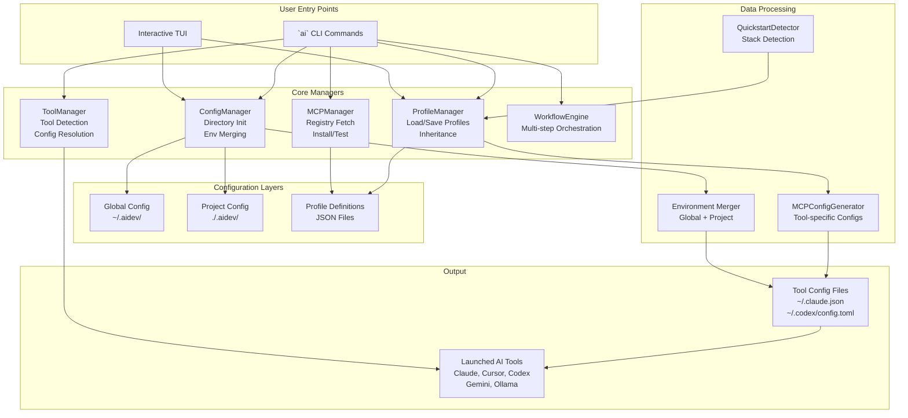
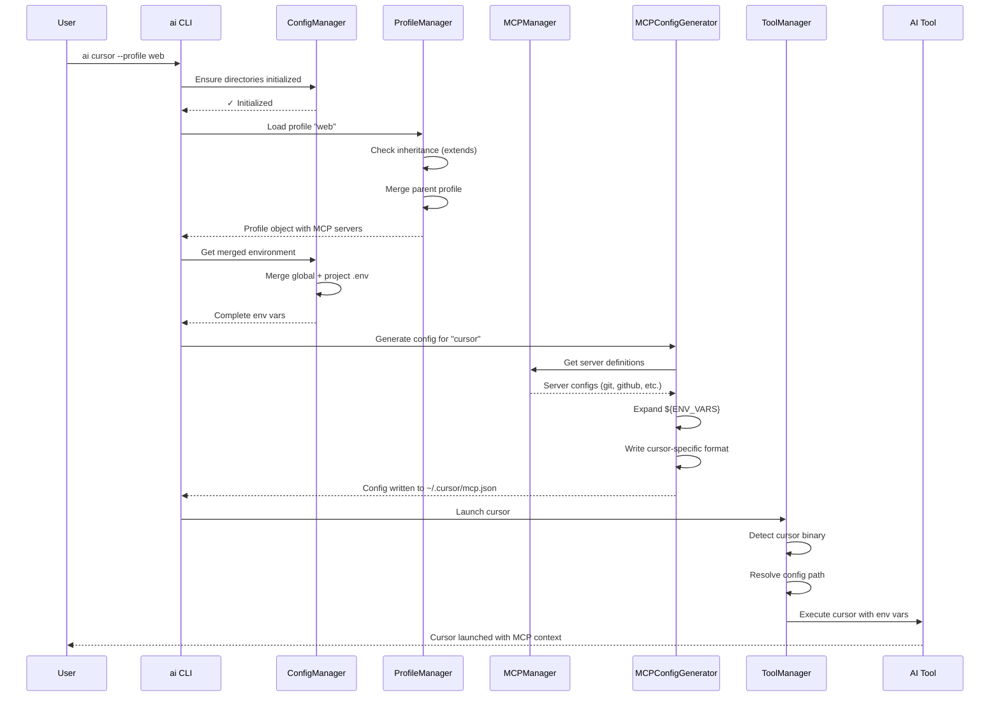
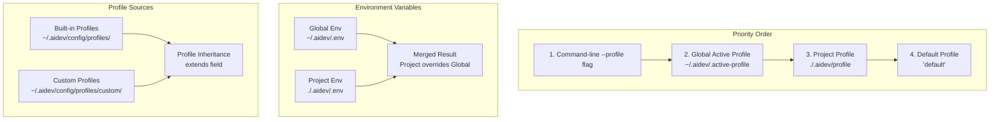
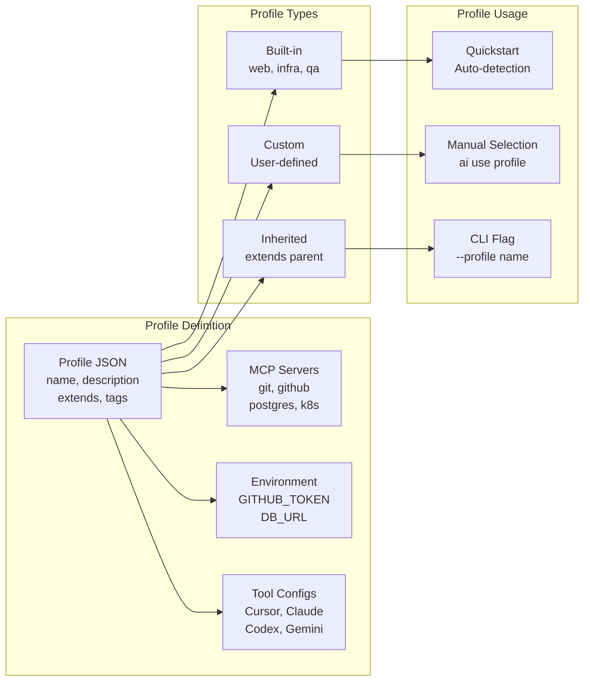
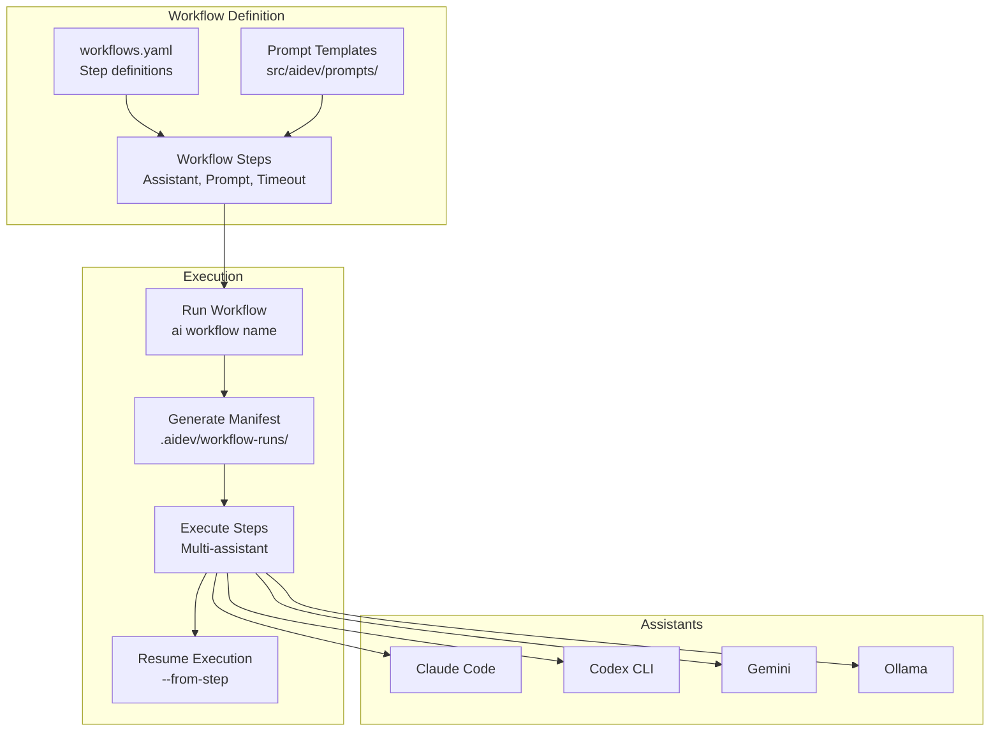
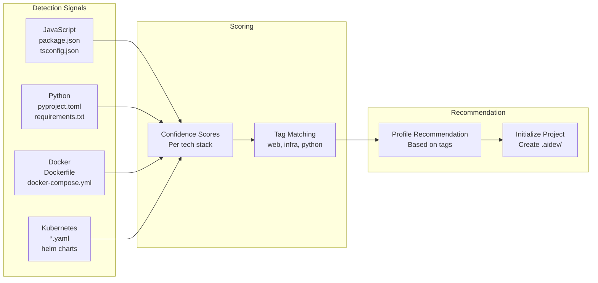
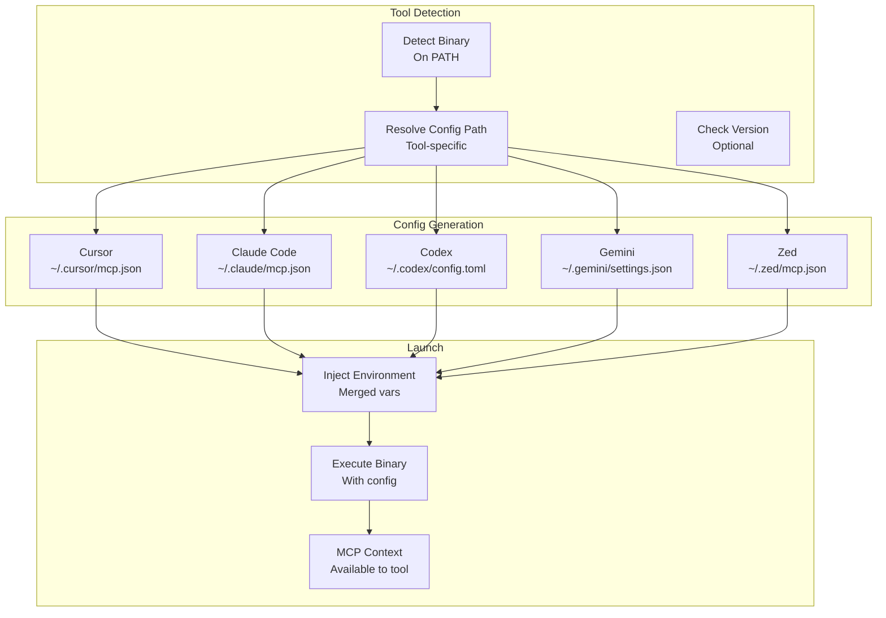

# aidev System Overview

A comprehensive visual guide to understanding how aidev works and how its powerful features connect together.

> **Note**: The diagrams below use Mermaid syntax, which renders automatically on GitHub, GitLab, and most modern markdown viewers. If you're viewing this in a plain text editor, you can preview the diagrams using VS Code with a Mermaid extension or online at [mermaid.live](https://mermaid.live).

## 🎯 High-Level Architecture



## 🔄 Complete Tool Launch Flow



## 📊 Configuration Hierarchy



## 🎭 Profile System Deep Dive



## 🔌 MCP Server Management Flow

```mermaid
graph TB
    subgraph "Discovery"
        REGISTRY[MCP Registry<br/>Remote + Cache]
        SEARCH[Search & Browse<br/>ai mcp search]
        TUI_BROWSE[TUI Browser<br/>ai mcp browse]
    end

    subgraph "Installation"
        INSTALL[Install Server<br/>ai mcp install]
        SAVE[Save Config<br/>~/.aidev/config/mcp-servers/]
        ENABLE[Enable in Profile<br/>Add to profile.json]
    end

    subgraph "Configuration"
        LOAD[Load Definition]
        EXPAND[Expand Env Vars<br/>${GITHUB_TOKEN}]
        GENERATE[Generate Tool Config<br/>Cursor/Claude/Codex]
    end

    subgraph "Usage"
        TEST[Test Connectivity<br/>ai mcp test]
        LAUNCH[Launch Tool<br/>ai cursor/claude]
        INJECT[Inject MCP Context]
    end

    REGISTRY --> SEARCH
    REGISTRY --> TUI_BROWSE
    SEARCH --> INSTALL
    TUI_BROWSE --> INSTALL
    INSTALL --> SAVE
    INSTALL --> ENABLE
    ENABLE --> LOAD
    LOAD --> EXPAND
    EXPAND --> GENERATE
    GENERATE --> TEST
    GENERATE --> LAUNCH
    LAUNCH --> INJECT
```

## 🚀 Workflow Orchestration System



## 🎯 Quickstart Detection Flow



## 🔐 Environment Variable Management

```mermaid
graph TB
    subgraph "Storage"
        GLOBAL_ENV[Global .env<br/>~/.aidev/.env]
        PROJ_ENV[Project .env<br/>./.aidev/.env]
        ENCRYPTED[Encrypted Values<br/>ENC::...]
    end

    subgraph "Operations"
        SET[Set Variable<br/>ai env set KEY value]
        LIST[List Variables<br/>ai env list]
        VALIDATE[Validate<br/>ai env validate]
        UNLOCK[Unlock Encryption<br/>ai env unlock]
    end

    subgraph "Usage"
        MERGE[Merge Global + Project<br/>Project overrides]
        EXPAND[Expand ${VARS}<br/>In MCP configs]
        INJECT[Inject to Tools<br/>Environment]
    end

    SET --> GLOBAL_ENV
    SET --> PROJ_ENV
    SET --> ENCRYPTED
    LIST --> GLOBAL_ENV
    LIST --> PROJ_ENV
    VALIDATE --> MERGE
    UNLOCK --> ENCRYPTED
    MERGE --> EXPAND
    EXPAND --> INJECT
```

## 🛠️ Tool Integration Points



## 📁 File Structure Overview

```
~/.aidev/                          # Global Configuration
├── config/
│   ├── profiles/                  # Profile definitions
│   │   ├── web.json
│   │   ├── infra.json
│   │   └── custom/               # User-created profiles
│   └── mcp-servers/              # MCP server configs
│       ├── git.json
│       ├── github.json
│       └── custom/               # Custom servers
├── .env                          # Global environment variables
├── .active-profile               # Global active profile (legacy)
└── cache/
    └── mcp-registry.json         # Cached MCP registry

./.aidev/                         # Project Configuration
├── config.json                   # Project settings
├── profile                       # Active profile for project
├── .env                          # Project environment variables
├── workflows.yaml                # Workflow definitions
└── workflow-runs/                # Execution manifests
    └── workflow-name-timestamp.json

~/.cursor/mcp.json                # Generated tool configs
~/.claude/mcp.json
~/.codex/config.toml
~/.gemini/settings.json
~/.zed/mcp.json
```

## 🎯 Key Design Principles

1. **Single Source of Truth**: One profile definition → multiple tool configs
2. **Configuration Hierarchy**: Project overrides global, explicit overrides implicit
3. **Inheritance**: Profiles can extend others, reducing duplication
4. **Validation**: Preflight checks ensure everything works before launch
5. **Encryption**: Sensitive data is encrypted at rest
6. **Offline Support**: Cached registry and bundled fallbacks
7. **Tool Agnostic**: Same profile works across all supported tools

## 🔗 Feature Connections

- **Profiles** → Define MCP servers → **MCP Manager** → Generates configs → **Tool Launcher**
- **Quickstart** → Detects stack → Recommends **Profile** → Initializes **Project Config**
- **Workflows** → Uses **Profiles** → Launches **Tools** → Executes **MCP-enabled** assistants
- **Environment** → Merged into **MCP configs** → Injected into **Tools**
- **TUI** → Edits **Profiles** and **Environment** → Updates **Configs** → Reflects in **Tools**

## 🚀 Common User Journeys

### First-Time Setup
```
ai setup → Configure profiles → Set env vars → ai quickstart → ai cursor
```

### Daily Development
```
cd project → ai cursor (uses project profile) → Work with MCP context
```

### Profile Switching
```
ai use infra → ai cursor → Different MCP servers active
```

### Workflow Execution
```
ai workflow doc_improver README.md → Multi-step execution → Results
```

### MCP Server Addition
```
ai mcp search postgres → ai mcp install postgres → Enable in profile → ai cursor
```

---

**Next Steps:**
- [Architecture Details](architecture.md) - Deep dive into internals
- [Features Guide](features.md) - Complete feature reference
- [Commands Reference](commands.md) - All available commands